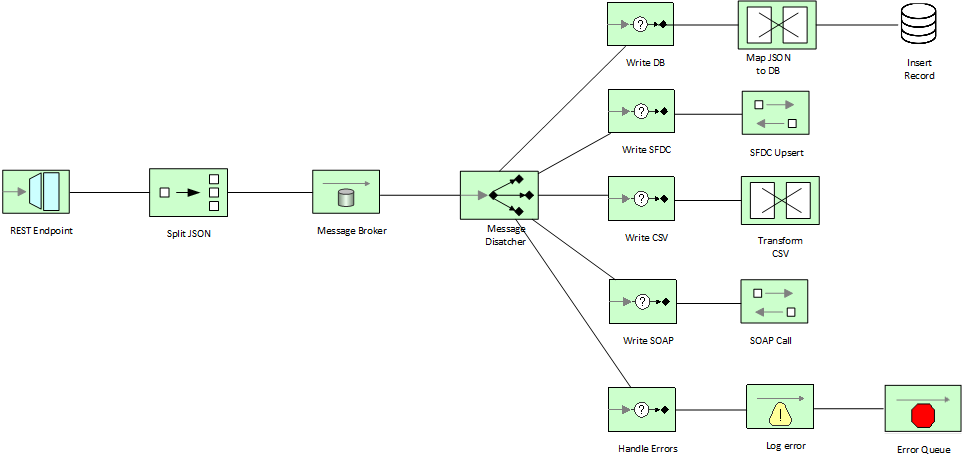

<h1 align="center">Contract-first Salesforce Integration with Fuse Online & Apache Camel</h1>

This project demonstrates a contract-first approach to developing the following workflow using Fuse Online and Apache Camel:

This flow includes the following services

1. [Flow One: API Endpoint](./api-endpoint)
2. [Flow Two: Persist to DB](./persist-db)
3. [Flow Three: Upsert to SFDC](./sfdc-upsert)
4. [Flow Four: Transform to CSV](./csv-transform)
5. [Flow Five: Forward to SOAP Endpoint](./forward-soap)
6. [SOAP Endpoint: The SOAP service endpoint for testing](./soap-endpoint)
