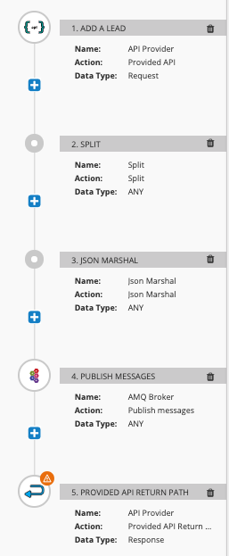

API Endpoint
=============

This flow takes a Swagger (OpenAPI) contract and exposes it as a RESTful endpoint.  During this process, it splits the incoming JSON array (sent as an HTTP POST) and publishes the message to an asynchronous messaging queue.

<p align="center">
  
</p>

### Structure of JSON Array

The JSON array is structured as follows:

```json
[{
	"lead": {
		"first_name": "Simon",
		"last_name": "Green",
		"company": "Red Hat",
		"source": "Partner Referral",
		"phone": "(212) 333-1234",
		"email": "sigreen@redhat.com",
		"status": "Closed Converted",
		"rating": "Warm"
	}
}, {
	"lead": {
		"first_name": "Josh",
		"last_name": "Reagan",
		"company": "Red Hat",
		"source": "Partner Referral",
		"phone": "(212) 333-9999",
		"email": "jreagan@redhat.com",
		"status": "Closed Converted",
		"rating": "Cold"
	}
}]
```

### Testing the flow

To test this flow, you can use the following curl statement:

```
curl --header "Content-Type: application/json" --data '[{"lead":{"first_name":"Simon","last_name":"Green","company":"Red Hat","source":"Partner Referral","phone":"(212) 333-1234","email":"sigreen@redhat.com","status":"Closed Converted","rating":"Warm"}},{"lead":{"first_name":"Josh","last_name":"Reagan","company":"Red Hat","source":"Partner Referral","phone":"(212) 333-9999","email":"jreagan@redhat.com","status":"Closed Converted","rating":"Cold"}}]' http://i-leads-api.fuse-66c3b847-5d25-11e9-ad61-0a580a010007.svc:8080/leads -X POST
```
